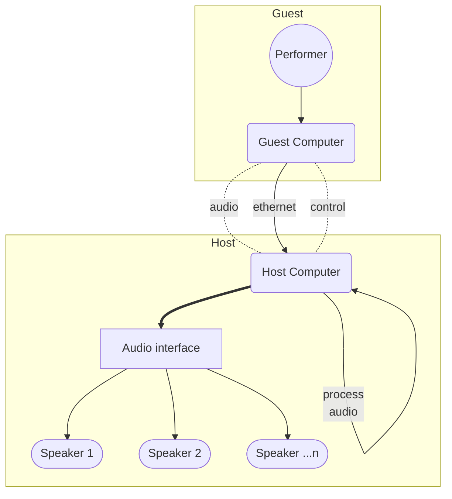

## Context

The goal is to develop:

- An immersive spatial audio environment...
- that is **reproducible** and **modular**...
- to nurture accessible platforms...
- for the creation and exhibition of immersive live performance.

### Immersive

Immersive environments seen to have popped up like beehives recently. Advertising a "brand new perspective," most of them just seem to slap existing art on four 100ft walls (see: Van Gogh Experience). These are especially popular in the warehouse exhibition spaces of big galleries looking to hone in on groundbreaking new tech that's still conservative enough to pull in the weekend crowd. Instagrammable is the new PG-13.

Since spatial audio is harder to capture on traditional video, not much goes into finetuning that aspect of the experience.

Our idea of immersion focuses on the development of the medium. Multi-speaker spatial audio enters in alpha stages, but soon get followed by inteactive physical environments and performance. Build on somewhat of a catalog of new media with the artists and interest that follow suite, but make sure we're going _somewhere_ new.

### Reproducible

A common pattern I've noticed is that immersive environments are... big. Sure, the grandeur feeds the illusion, but that size needs space and rent is steep. Many spaces are invite-only, custom setups that barre many from playful access without a plug.

Rolling your own is even harder because god knows what the software standard is nowadays with VR game devs butting heads with bearded MaxMSP professors. That's not even accounting for the organ donation needed to buy the hardware or the potential headaches when the venue can't accept your hardware/software/format.

The process can be visualised with this graph:

I envision a much lower barrier of entry that decouples performer from the needs of a space. You know how DJs prep a whole set only to pull up to the function with a USB stick (!) to find the exact same CDJ as everywhere else (well, mostly)? Yes, tech riders make this explicit, but the general format is tried and true with everyone on the same page (we leave the vinyl crowd alone).

With most electronic sets, the performer is expected to bring their audio interface and route a stereo audio line to the desk - just like as any other live music setup. Problem is spatial audio usually requires more than 2 channels and multi-output audio interfaces are expensive. Your live set is digital and on your laptop anyway, so why not hit the spatial audio venue with an ethernet cable to just stream your audio? alongside commands to say what should play where in 3D space. Just like a band playing their instruments, they get their end and let the venue handle the specifics of their setup (we'll get to the how soon).

### Modular

In order to reduce the barriers to the creation of the environment, steps must be taken to be adaptable to the host's resources such as:

- Space - Structures must be able to easily adapt to varying sizes of venues.
- Funds - Required materials must strive to be software- and hardware-agnostic. Open-source software should be used wherever possible and designs must allow for the use of cheap hardware and recycled materials.

## Structure

