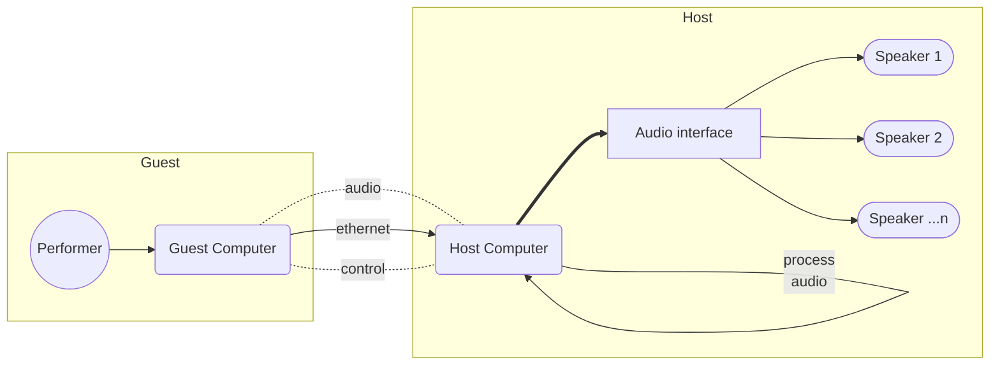

## Vision 
The goal is to develop:
> An immersive audiovisual environment that is reproducible and modular in order to nurture accessible platforms for the creation and exhibition of immersive live performance.

### Reproducible
In order to ensure that the environment an artist creates in can be successfully recreated in a live setting, the environment must be easily replicated.

### Modular
In order to reduce the barriers to the creation of the environment, steps must be taken to be adaptable to the host's resources such as:
- Space - Structures must be able to easily adapt to varying sizes of venues.
- Funds - Required materials must strive to be software- and hardware-agnostic. Open-source software should be used wherever possible and designs must allow for the use of cheap hardware and recycled materials.

## Structure

